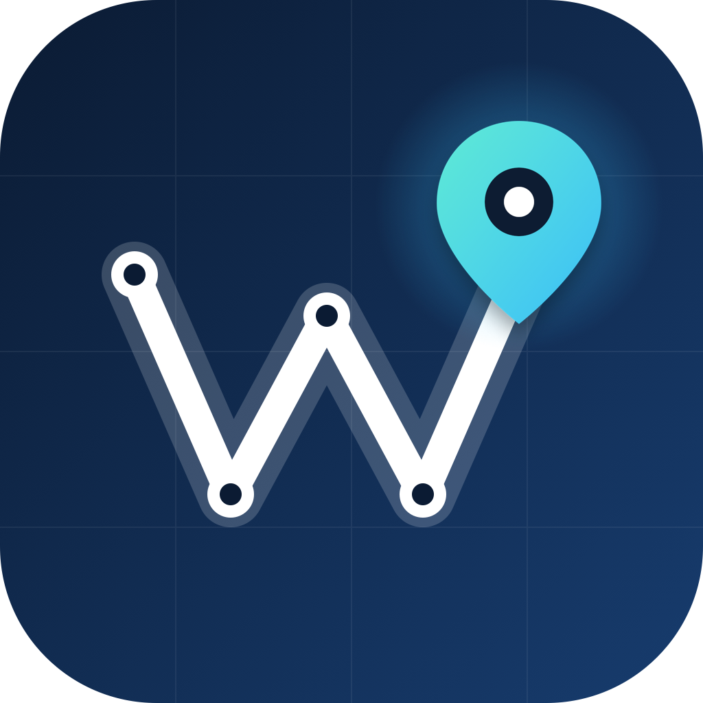

<p align="center">
  
</p>

# Waypoint

Tab-based SwiftUI navigation: one `NavigationStack` per tab, modal flows with their own stacks, and a single `WaypointNavigator` entry point.

## Usage

```swift
import Waypoint

let tabs = AppTab.allCases.map { tab in
    RootTab(id: tab) { tab.rootView }
}

let navigator = WaypointNavigator.shared

WaypointTabView(tabs: tabs)

navigator.navigate(to: DetailView(), mode: .push)
navigator.navigate(to: SettingsView(), mode: .present(.sheet))
navigator.switchTab(to: AppTab.inbox)
```

## Setup

`WaypointTabView(tabs:)` is the only setup step; pass it the root tabs, and it wires up routing for each as it's mounted.

```swift
@main
struct MyApp: App {
    var body: some Scene {
        WindowGroup {
            WaypointTabView(tabs: AppTab.allCases.map { tab in
                RootTab(id: tab) { tab.rootView }
            })
        }
    }
}
```

Tabs may change over time. When `tabs` updates, routers for tabs that remain are kept as-is, routers for removed tabs are torn down, and the selection falls back to the first tab if the previously selected one was removed. `switchTab(to:)` traps when asked for a tab that is not in the current list.

## Rules

Waypoint is app-agnostic. It has no dependencies beyond SwiftUI; dependency injection and app types stay in the app.
The first root tab is the initially selected one.
